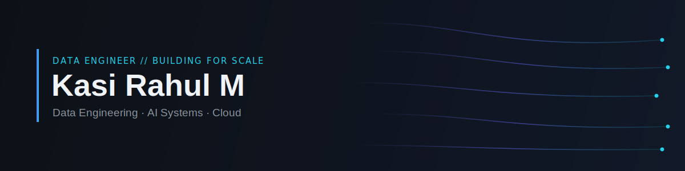
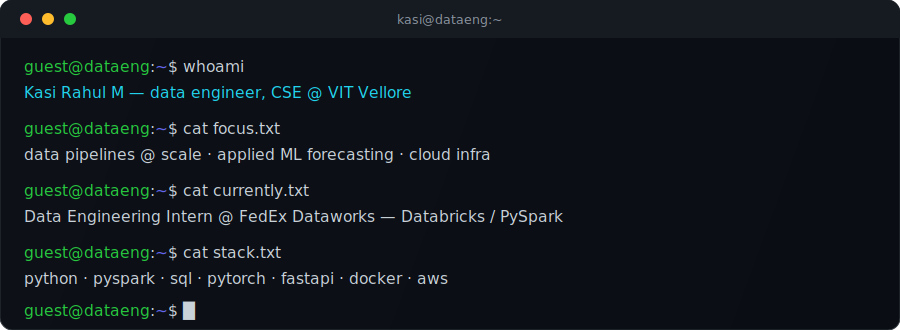
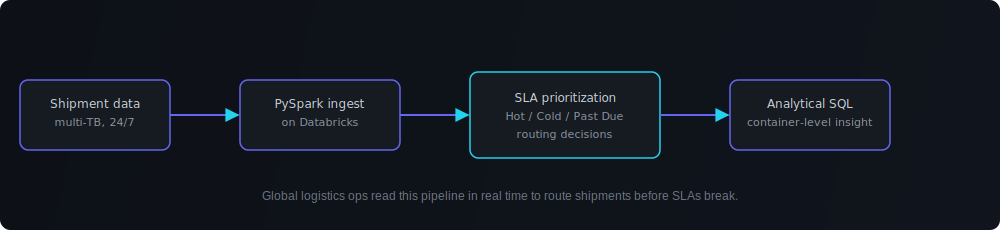
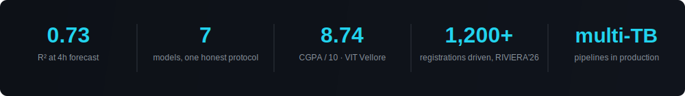

---

### About

I'm a CSE undergraduate at **VIT Vellore** (CGPA **8.74/10.0**, graduating 2027) who cares more about whether a pipeline holds up in production than whether a notebook looks good. I've moved multi-TB shipment data through Databricks pipelines at FedEx, and traced a forecasting model's R² from **-1.7 to 0.70** by finding a leakage bug most write-ups would have shipped past.

---

### Signature system — Logistics Shipment Pipeline

Built at **FedEx Dataworks**: multi-TB shipment logistics data ingested and transformed via **PySpark on Databricks**, tagged into SLA-driven priority tiers for split-second routing, then exposed through analytical SQL for container-level ops insight.

---

### Tech I build with

**Data / ML** · PySpark · Databricks · SQL · PyTorch · scikit-learn · pandas

**Cloud / Backend** · FastAPI · Docker · AWS · Oracle Cloud (GenAI Certified) · Git · Linux

---

### Featured Projects

#### [CloudSense](https://github.com/KasiRahul97/CloudSense)
**Leakage-free cloud CPU forecasting.** `PyTorch · FastAPI · Docker · AWS`

- 4-hour-ahead CPU forecasting, **R² 0.730 / MAE 5.72%**, served live behind FastAPI with zero train/serve skew
- Diagnosed and fixed a causal leak — RevIN normalization took the LSTM baseline from **R² -1.70 to 0.70**
- Honest **7-model benchmark** (CEEMDAN+CNN-BiLSTM, Transformer, LSTM, naive baselines) on real Numenta NAB telemetry
- 30 passing tests, GitHub Actions CI, Dockerized inference API and dashboard

#### [PAXA AI Assistant](https://github.com/KasiRahul97/PAXA-AI-Assistant)
**Multi-agent AI orchestration.** `Python · LLM · Memory Systems`

- Separates orchestration (`core/`) from execution (`agents/`), with a `services/` backend layer
- Persistent memory (`models/`, SQLite-backed) so context survives across sessions
- `frontend/` interaction layer wired to the same orchestration core

---

### By the numbers

Numbers from shipped work — see [CloudSense](https://github.com/KasiRahul97/CloudSense).

---

### Achievements & Certifications

- **Oracle Cloud Infrastructure 2024 Generative AI Certified Professional** — LLM fundamentals, prompt engineering, RAG systems
- **Student Manager, Publicity & Marketing — RIVIERA'26** (VIT's annual cultural fest) — led nationwide outreach to **1,200+ external registrations**
- **Management Head, Geospatial Club, VIT** — executive board member; planned and executed technical events and workshops

*I care about whether the pipeline survives production, not just the demo.* · Let's talk data.
